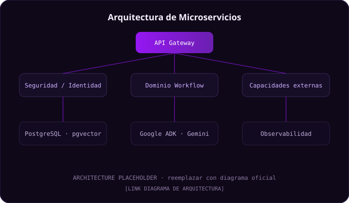

# Synapse-Flow Portfolio

Sitio web estático tipo portafolio académico-profesional del proyecto final
**Synapse-Flow · Intelligent Agent Orchestration Platform**, desarrollado por el
equipo **Fantasy Labs** para el socio formador **Banorte**, como parte de un reto
académico del **Tecnológico de Monterrey**.

El sitio es una sola página (`index.html`) con navegación por secciones, construida
únicamente con **HTML + CSS + JavaScript vanilla**. No usa frameworks, ni build tools,
ni dependencias externas. Funciona abriendo `index.html` en el navegador y desplegado
en **GitHub Pages**.

---

## 🗂 Estructura del proyecto

```
/
├── index.html              ← Página principal (10 secciones con anchors)
├── styles.css              ← Estilos (variables de color en :root, responsive)
├── script.js               ← JS vanilla: menú móvil, sección activa, volver arriba
├── README.md               ← Este archivo
├── REPORTE_PORTAFOLIO.md   ← Plantilla del reporte escrito (rúbrica M1) para exportar a PDF
└── assets/
    ├── README.md                      ← Guía para reemplazar imágenes
    ├── logo-placeholder.svg
    ├── hero-placeholder.svg
    ├── architecture-placeholder.svg
    ├── workflow-placeholder.svg
    ├── stack-placeholder.svg
    └── demo-placeholder.svg
```

---

## ✏️ Cómo editar el contenido

Todo el contenido está en `index.html`. Cada bloque editable tiene comentarios HTML
que empiezan con `<!-- EDITAR: ... -->` o `<!-- NOTA: ... -->` para ubicarlo rápido
en VS Code (usa `Ctrl/Cmd + F` y busca `EDITAR`).

### Reemplazar placeholders de texto y links

Los datos que faltan están marcados visualmente con la clase `.ph` y se ven con un
fondo amarillo punteado en la página, por ejemplo:

```html
<span class="ph">[LINK VIDEO DEMO]</span>
```

Para completarlos:

1. Busca el placeholder en `index.html` (`Ctrl/Cmd + F` → `[LINK`).
2. Reemplaza **todo** el `<span class="ph">...</span>` por el texto o link real.
   - Para un enlace, edita el `href="#"` del `<a>` que lo contiene y borra el `<span class="ph">`.

Ejemplo — antes:
```html
<a class="btn btn--ghost" href="#">▶ Video demo <span class="ph">[LINK VIDEO DEMO]</span></a>
```
Ejemplo — después:
```html
<a class="btn btn--ghost" href="https://youtu.be/tu-video">▶ Video demo</a>
```

### Cambiar las etiquetas de estado (badges)

Las tablas de requerimientos, microservicios y ambientes usan badges de estado.
Cambia la clase para reflejar el estado real:

| Clase                  | Significado     |
|------------------------|-----------------|
| `badge badge--done`       | Implementado    |
| `badge badge--partial`    | Parcial         |
| `badge badge--validating` | En validación   |
| `badge badge--future`     | Futuro          |

```html
<!-- de Parcial a Implementado -->
<span class="badge badge--partial">Parcial</span>
<!-- cambiar a -->
<span class="badge badge--done">Implementado</span>
```

> ⚠️ **No inventes métricas, resultados ni usuarios de prueba.** Deja los placeholders
> hasta tener el dato real (es preferible un `[RESULTADO]` visible a un número falso).

### Cambiar colores / identidad visual

Edita las variables CSS en `:root` al inicio de `styles.css`. El color principal es
`--color-acento: #9517F2;`.

---

## 🖼 Cómo agregar imágenes a `assets/`

1. Copia tu imagen (PNG, JPG o SVG) dentro de la carpeta `assets/`.
2. En `index.html`, reemplaza el `src` del placeholder correspondiente:
   ```html
   
   <!-- cámbialo por -->
   
   ```
3. **Actualiza siempre el `alt`** con una descripción real (accesibilidad).

Más detalle en [`assets/README.md`](assets/README.md).

---

## 🧪 Cómo probar localmente

**Opción A — abrir el archivo directamente:**
Haz doble clic en `index.html`. Funciona sin servidor.

**Opción B — servidor local (recomendado, evita problemas de rutas):**
```bash
# Python 3
python3 -m http.server 8000
# luego abre http://localhost:8000
```

---

## 🚀 Cómo desplegar en GitHub Pages

1. Ve a **Settings** del repositorio en GitHub.
2. Entra a la sección **Pages**.
3. En **Source**, elige **Deploy from a branch**.
4. **Branch:** `main`.
5. **Folder:** `/ (root)`.
6. Haz clic en **Save**.
7. Espera 1–2 minutos a que GitHub genere la URL pública (aparece en esa misma pantalla).

La URL será del tipo `https://nanocaballero.github.io/Synapse-Flow-Portfolio/`.

---

## ✅ Pendientes para el equipo (placeholders a llenar)

- [ ] Exportar `REPORTE_PORTAFOLIO.md` a PDF, subirlo (Drive/eLumen) y pegar el link en el sitio (Anexos → "Reporte del portafolio (M1)")
- [ ] `[LINK VIDEO DEMO]` — video demostrativo del producto
- [ ] `[LINK DOCUMENTO DE REQUERIMIENTOS]`, `[LINK DOCUMENTO DE DISEÑO]`, `[LINK SCMP]`, `[LINK PLAN DE CIERRE]`
- [ ] Objetivo general (3.5) y objetivos específicos (3.6)
- [ ] Estado real de cada requerimiento funcional y microservicio (badges)
- [ ] Evidencias (capturas/links) en tablas RF, RNF, microservicios y CI/CD
- [ ] Resultados de pruebas de usabilidad (7.3), hallazgos (7.4), NPS
- [ ] Plan de pruebas de aceptación y pruebas de seguridad
- [ ] Tabla de ambientes (8.4): URLs, usuario/contraseña demo, estado
- [ ] Logros del proyecto (9.2)
- [ ] Links de gestión (GitHub Project / Jira), EDT, drive de evidencias
- [ ] Diagramas reales (arquitectura, stack, componentes, modelo de datos, deployment)
- [ ] Reemplazar SVGs placeholder de `assets/` por capturas/diagramas reales
- [ ] (Opcional) reemplazar `logo-placeholder.svg` por el logo real de Fantasy Labs

> Tip: busca en `index.html` la clase `ph` para encontrar todos los placeholders pendientes.

---

## 🔗 Links principales

- **Presentación final:** https://canva.link/q8ph9rxii8e6q1n
- **GitHub Backend:** https://github.com/salog0d/Synapse-Microservices.git
- **GitHub Frontend:** https://github.com/aleordaz1130/Synapse-Frontend.git

---

_Synapse-Flow · Fantasy Labs · Tecnológico de Monterrey · Socio formador Banorte · 2026_
